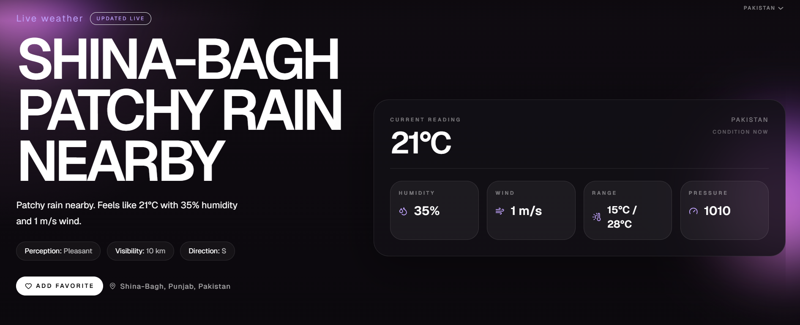
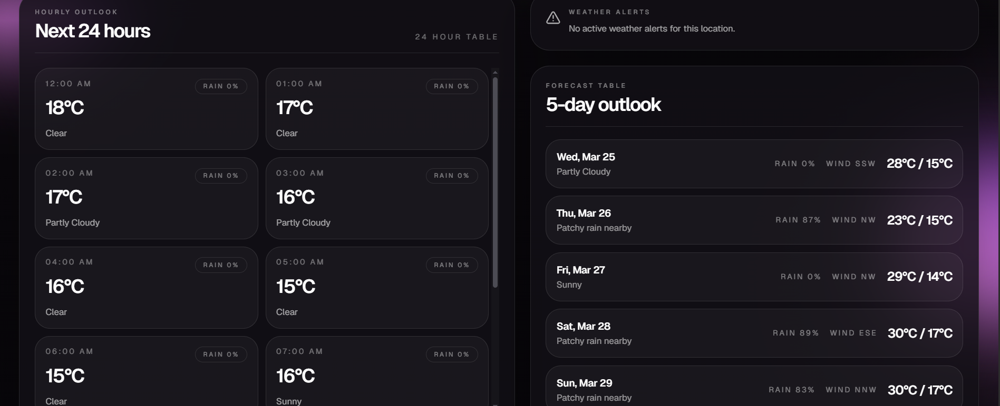
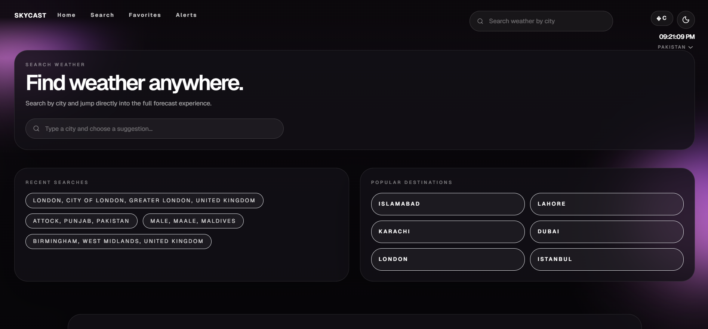
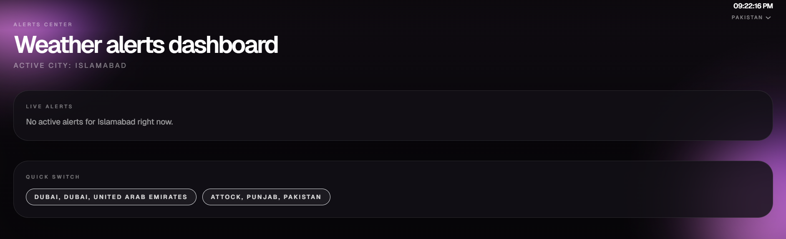

# SKYCAST

Premium full-stack weather platform built with a motion-first React frontend and a production-oriented Node.js backend.

## Overview

SKYCAST delivers:

- Live current weather by city or coordinates
- Multi-day forecast with hourly outlook
- Air quality and astronomy insights
- Favorites, alerts, and search experience
- Framer-inspired UI with Tailwind and smooth motion
- Secure backend with validation, caching, rate limiting, and logging

## Screenshots









## Tech Stack

### Frontend

- React
- Vite
- Tailwind CSS
- Framer Motion
- React Router
- React Query
- Zustand
- Recharts
- Lucide React

### Backend

- Node.js
- Express
- Axios
- WeatherAPI.com
- Helmet
- Compression
- CORS
- Winston
- NodeCache
- Express Rate Limit
- Express Validator

## Core Features

- City search with autocomplete-ready backend search
- Current weather, hourly outlook, and multi-day forecast
- Air quality breakdown with pollutant metrics
- Astronomy panel with sunrise, sunset, and solar noon
- Geolocation-aware home experience
- Favorites management with local persistence
- Dark premium interface with editorial layout
- Live header clock with timezone switching

## Architecture

```text
modern-weather-system/
+-- backend/
|   +-- src/
|   |   +-- config/
|   |   +-- controllers/
|   |   +-- middleware/
|   |   +-- routes/
|   |   +-- services/
|   |   `-- utils/
|   +-- .env.example
|   `-- package.json
+-- frontend/
|   +-- public/
|   +-- src/
|   |   +-- components/
|   |   +-- hooks/
|   |   +-- pages/
|   |   +-- services/
|   |   +-- stores/
|   |   `-- utils/
|   +-- .env.example
|   `-- package.json
`-- docs/
    `-- screenshots/
```

## Local Development

### 1. Clone

```bash
git clone <your-repository-url>
cd modern-weather-system
```

### 2. Backend setup

```bash
cd backend
npm install
copy .env.example .env
```

Set your WeatherAPI key in `.env`:

```env
PORT=5000
NODE_ENV=development
WEATHER_API_KEY=your_weatherapi_key
FRONTEND_URL=http://localhost:5173
LOG_LEVEL=info
REQUEST_SIZE_LIMIT=10kb
```

Run the backend:

```bash
npm run dev
```

### 3. Frontend setup

```bash
cd ../frontend
npm install
copy .env.example .env
```

Frontend env:

```env
VITE_API_URL=http://localhost:5000/api/v1
```

Run the frontend:

```bash
npm run dev
```

## API Endpoints

Base URL: `http://localhost:5000/api/v1`

- `GET /weather/current?city=Islamabad`
- `GET /weather/forecast?city=Islamabad&days=5`
- `GET /weather/search?q=Isl`
- `GET /weather/coordinates?lat=33.6844&lon=73.0479`
- `GET /weather/air-quality?city=Islamabad`
- `GET /weather/astronomy?city=Islamabad`
- `GET /weather/alerts?city=Islamabad`
- `GET /health`

## Production Notes

- Weather data is powered by WeatherAPI.com
- Backend responses are normalized for frontend-friendly consumption
- Sensitive values stay in environment variables
- Cache and rate limiting are enabled to reduce provider load
- Frontend is production-build verified with Vite

## API Key Requirement

This project will not run correctly without a valid weather API key.

To use SKYCAST locally or in production, create your own free API key from WeatherAPI:

[https://www.weatherapi.com/](https://www.weatherapi.com/)

After creating the key, place it in:

`backend/.env`

Example:

```env
WEATHER_API_KEY=your_weatherapi_key_here
```

## Verification

Verified locally:

- Backend health endpoint responds successfully
- Frontend production build passes
- Weather search, current weather, forecast, air quality, and astronomy flows are connected

## Author

**Asfahan Javed**

- Email: [asfahanjaved126@gmail.com](mailto:asfahanjaved126@gmail.com)
- GitHub: [AsfahanJaved328](https://github.com/AsfahanJaved328)
- LinkedIn: [asfahan-javed-65455b343](https://www.linkedin.com/in/asfahan-javed-65455b343)
- Instagram: [asfah_an1](https://www.instagram.com/asfah_an1?igsh=MWFhdWRzNm5ycjd5eQ==)

## Repository Notes

Recommended repository name:

`skycast-modern-weather-system`

Recommended short description:

`Premium full-stack weather platform with React, Framer Motion, Tailwind, Express, and WeatherAPI integration.`
